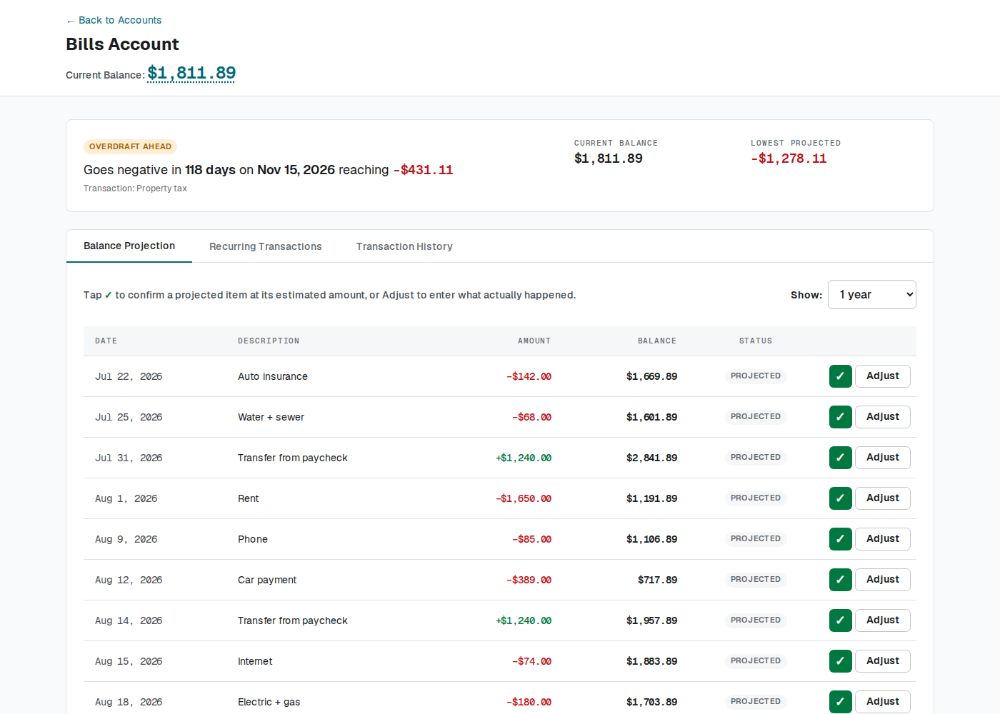
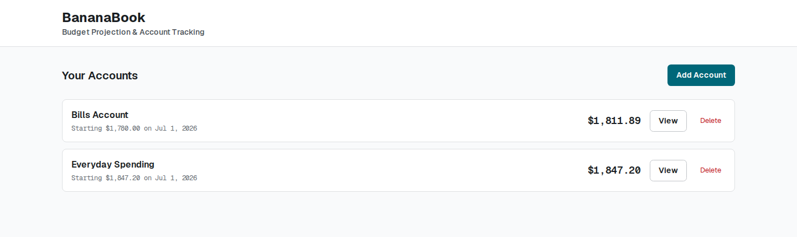

# BananaBook

> A forward-looking checkbook for the account that pays your bills. It projects the
> balance forward and names the exact date it runs dry — so the bills stay funded, and
> whatever sits in your other account is genuinely yours to spend.

[](https://github.com/majoragee/bananabook/actions/workflows/ci.yml)
[](LICENSE)



## The method

BananaBook is built to support a specific, deliberately simple way of managing money —
one designed to reduce financial stress and to minimize the time spent thinking about
it at all.

1. **Open a separate account just for recurring bills.**
2. **Automatically divert a fixed portion of every paycheck into it**, enough to cover
   those bills as they come due.
3. **Spend freely from whatever is left.** The balance in your everyday account is
   money you can spend without arithmetic, because every bill is already funded from
   somewhere else.

The appeal is what it removes. No categories, no envelopes, no weekly budget review, no
deciding whether this purchase is affordable. One number in one account answers that.

The hard part is step 2 — picking the transfer amount, and knowing whether it is still
right six months later. Bills change. Annual costs land in a lump. Set the transfer too
low and the bills account quietly drains until something bounces; set it too high and
money that could have been spent or invested sits there doing nothing.

**That is the job BananaBook does.** It models the bills account so you can:

- **Size the transfer** — adjust the recurring deposit and watch the projected low point
  move until it settles where you want it.
- **Reconcile quickly** — confirm each bill as it lands, at the estimated amount in one
  click or at what actually hit the account, so the forecast stays true.
- **See a shortfall coming** — with a date attached, months before it happens.
- **Catch over-funding** — if the projected low point never dips near zero, you are
  parking more than you need and can dial the transfer back.

## What it looks like

Most budgeting tools are rear-view mirrors: they categorize what already left your
account. That is useful for judging the past and useless for answering the question
that actually matters — **are the bills covered, and for how long?**

BananaBook answers with a date. In the screenshot above, the bills account holds
$1,811.89 and looks perfectly healthy. It isn't: the transfers are running about
$100/month short of what the bills actually cost, and the annual property tax on
November 15 pushes it to **-$431.11**. That is 118 days of warning — long enough to
raise the transfer by a few dollars a paycheck and never notice the problem again.

The second account needs no forecast at all. Its balance *is* the answer.

## Features

- **Balance projection** — every account projected forward from a starting balance
  plus recurring deposits and expenses, over a horizon you choose (1 month to 2 years).
- **Overdraft date** — the headline verdict on every account: how many days until the
  balance goes negative, on what date, and how deep it goes.
- **Recurring transactions** — daily, weekly, bi-weekly, monthly, or yearly, with
  optional end dates, and the ability to deactivate one without deleting its history.
- **The reconcile loop** — confirm each projected item as it happens, either at the
  estimated amount (one click) or at what actually hit the account. The forecast you
  trusted last month stays honest this month.
- **Projected vs. actual** — reconciling at a different amount records the variance
  instead of hiding it, and can optionally update the recurring estimate going forward.
- **Lowest projected balance** — the floor the account is heading for over the whole
  horizon, which is what tells you whether you are under- or over-funding the transfer.
- **Multiple accounts** — the bills account alongside anything else you want to track,
  each projected independently.
- **No account linking** — nothing connects to your bank. You type the numbers in; they
  stay on your machine.



The bills account is the one being managed. The everyday account carries no recurring
items at all — under this method you never forecast it, you just read it.

## Security and threat model

**Read this before you deploy anything.**

BananaBook has **no authentication whatsoever**. There are no users, no login, no
sessions, and no authorization checks. Anyone who can reach the port can read, edit,
and delete every financial record in the database.

That is a deliberate design choice for its intended use — a single self-hosted
household instance on a trusted home network, where everyone in the house is meant to
see the same numbers. It is emphatically **not** safe to expose to the internet.

Run it on `localhost` or a trusted LAN only. If you need remote access, put it behind
something that actually does authentication — a VPN such as WireGuard or Tailscale, or
a reverse proxy enforcing auth in front of it. Do not simply forward a port.

Also note:

- There is no rate limiting, CSRF protection, or audit logging.
- The SQLite database is stored unencrypted on disk.
- `synchronize: true` is enabled in TypeORM (see [Known limitations](#known-limitations)).

Found a security problem? See [SECURITY.md](SECURITY.md).

## Quick start

Requires **Node.js 20 or newer**.

```bash
git clone https://github.com/majoragee/bananabook.git
cd bananabook
npm install
npm run dev
```

Open <http://localhost:3000>. The SQLite database is created automatically on first
run; there is no migration step and no seed data.

To set it up the way the method intends: create one account for your bills, set its
starting balance to whatever is in the real account today, then add your recurring
bills as expenses and the automatic paycheck transfer as a deposit. The projection —
and the date you run dry — appears immediately. Adjust the transfer amount until the
lowest projected balance sits at a cushion you are comfortable with.

### Running the tests

```bash
npm test
```

The suite covers the projection engine — frequency expansion, end dates, the running
balance, the overdraft date, and the reconcile loop. It runs against a temporary SQLite
database with the clock frozen, so it never touches your data and never depends on
today's date.

### Docker

A prebuilt image is published to GitHub Container Registry for `linux/amd64` and
`linux/arm64`, so it runs on an x86 server or a Raspberry Pi without building
anything:

```bash
docker run -d \
  --name bananabook \
  -p 3000:3000 -p 3001:3001 \
  -v bananabook-data:/app/data \
  ghcr.io/majoragee/bananabook:latest
```

Or with compose, building from source instead:

```bash
cp docker-compose.yml.example docker-compose.yml
docker compose up -d
```

Then open <http://localhost:3000>. Data persists in the `bananabook-data` volume.

Available tags: `latest` (most recent release), `0.1.0` / `0.1` (specific versions),
`main` (tip of the default branch), and `sha-<commit>` (an exact commit). Pin a
version tag for anything you care about — `main` moves.

Full deployment notes, including backup and restore, are in
[README.docker.md](README.docker.md).

## Configuration

Copy `.env.example` to `.env` for local development.

| Variable   | Default            | Purpose |
|------------|--------------------|---------|
| `NODE_ENV` | `development`      | Standard Node environment flag. |
| `DATA_DIR` | current directory  | Where `bananabook.db` is written. Set to `/app/data` in Docker. |

> **Don't set `PORT`.** The frontend and the API are two processes started by a single
> `npm start`, and both read `PORT` — setting it makes them collide on the same port
> and the API will fail to bind. The frontend is fixed on 3000 and the API on 3001.
> To change what the outside world sees, remap the ports in `docker-compose.yml`
> instead.

## How the projection works

`server/routes/projections.ts` builds the forecast for an account:

1. Start from the account's `startingBalance` at its `startDate`.
2. Expand every active recurring transaction across the requested horizon, stepping by
   its frequency and stopping at its `endDate` if it has one.
3. Replace any projected item that has been reconciled with the real transaction, so
   actuals always beat estimates.
4. Sort by date and accumulate a running balance.
5. Report the first entry where the balance drops below zero — that's the overdraft date.

## API reference

The API is served by Express on port 3001, and proxied at `/api` by Next.js so the
browser only ever talks to port 3000.

| Method | Endpoint | Description |
|--------|----------|-------------|
| `GET` | `/api/health` | Liveness check. |
| `GET` | `/api/accounts` | List all accounts. |
| `GET` | `/api/accounts/:id` | One account, with its recurring and actual transactions. |
| `POST` | `/api/accounts` | Create an account. |
| `PUT` | `/api/accounts/:id` | Update an account. |
| `DELETE` | `/api/accounts/:id` | Delete an account and everything under it. |
| `GET` | `/api/recurring-transactions` | List recurring items, filterable by account. |
| `GET` | `/api/recurring-transactions/:id` | One recurring item. |
| `POST` | `/api/recurring-transactions` | Create a recurring item. |
| `PUT` | `/api/recurring-transactions/:id` | Update a recurring item. |
| `DELETE` | `/api/recurring-transactions/:id` | Delete a recurring item. |
| `GET` | `/api/transactions` | List actual transactions; filter by `accountId`, `reconciled`. |
| `GET` | `/api/transactions/:id` | One transaction. |
| `POST` | `/api/transactions` | Record a one-off transaction. |
| `POST` | `/api/transactions/reconcile` | Confirm a projected item, optionally at a corrected amount. |
| `PUT` | `/api/transactions/:id` | Update a transaction. |
| `DELETE` | `/api/transactions/:id` | Delete a transaction. |

## Tech stack

| | |
|---|---|
| Frontend | Next.js 16 (App Router), React 19, Tailwind CSS 4 |
| Backend  | Express 5, TypeORM 0.3 |
| Database | SQLite via `better-sqlite3` |
| Language | TypeScript |
| Deploy   | Docker, multi-stage build, runs as a non-root user |

The design brief the interface is built against lives in [PRODUCT.md](PRODUCT.md).

## Known limitations

Worth knowing before you trust this with anything important:

- **No authentication.** See [Security and threat model](#security-and-threat-model).
- **`synchronize: true`.** TypeORM alters the SQLite schema to match the entity
  definitions on every boot. Convenient in development, but it means a future schema
  change could alter or drop a column on upgrade. **Back up `bananabook.db` before
  updating.** Proper migrations are on the roadmap.
- **Money is stored as floating point.** Amounts are `decimal` columns read back as JS
  numbers, so arithmetic can drift by fractions of a cent. Display is rounded to two
  decimals, but the underlying values are not exact. Integer-cents storage is on the
  roadmap.
- **A monthly item dated the 31st drifts.** Months without a 31st roll the occurrence
  into the following month (Jan 31 → Mar 3), rather than clamping to the last day.
  There is a test pinning this behaviour so it can be fixed deliberately.
- **Test coverage is partial.** The projection engine is covered; the routes around it
  are not.
- **Single currency, no formatting options.** Amounts are rendered as USD.

## Roadmap

- Test coverage for the API routes, not just the projection engine
- Clamp monthly items to the last day of short months
- Database migrations, replacing `synchronize: true`
- Integer-cents money storage
- Optional authentication for non-LAN deployments
- CSV import and export

## Contributing

Issues and pull requests are welcome — see [CONTRIBUTING.md](CONTRIBUTING.md).
This is a personal project built for one household's needs, so it is opinionated about
scope; opening an issue before a large PR will save you time.

## License

[MIT](LICENSE) © Craig

## AI disclosure

AI assistance was used in the development of this project.
